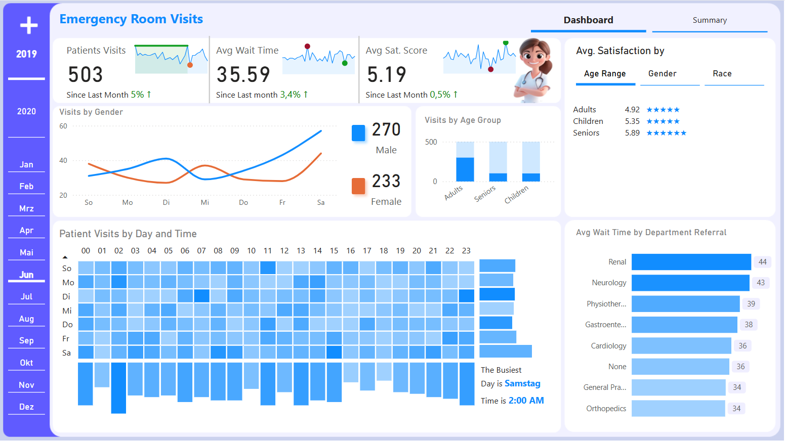
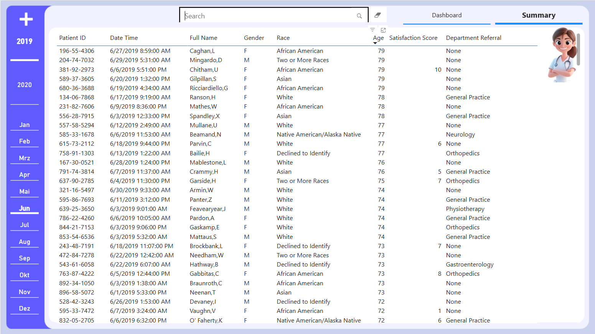

# About the Project: Hospital Dashboard

This repo is about the process of creating a dashboard visualizing analyzing hospital emergency room performance and efficiency. The datasets were originally in CSV, and then imported to PowerBI.

The dataset was cleaned and improve through using DAX in PowerBI. The new Table, new measure and new connections were created, helped for building of dashboard.

Through this dashboard, I hope to showcase my skills and provide insight into my future career direction.

PowerBI Public: https://app.powerbi.com/view?r=eyJrIjoiNzQ0MzY4OTAtYTk4Ny00MzBjLWFiOTEtZWRiMDU0M2RiMmY4IiwidCI6ImQyZmIwYjU5LTNlODctNDIwNS1iMjc0LWU1NDM4ZmRjYmViZSJ9

Data Source: https://drive.google.com/drive/folders/15bMU96_ZcGb8R8EgbwVf4UbKzvkCsuOS

